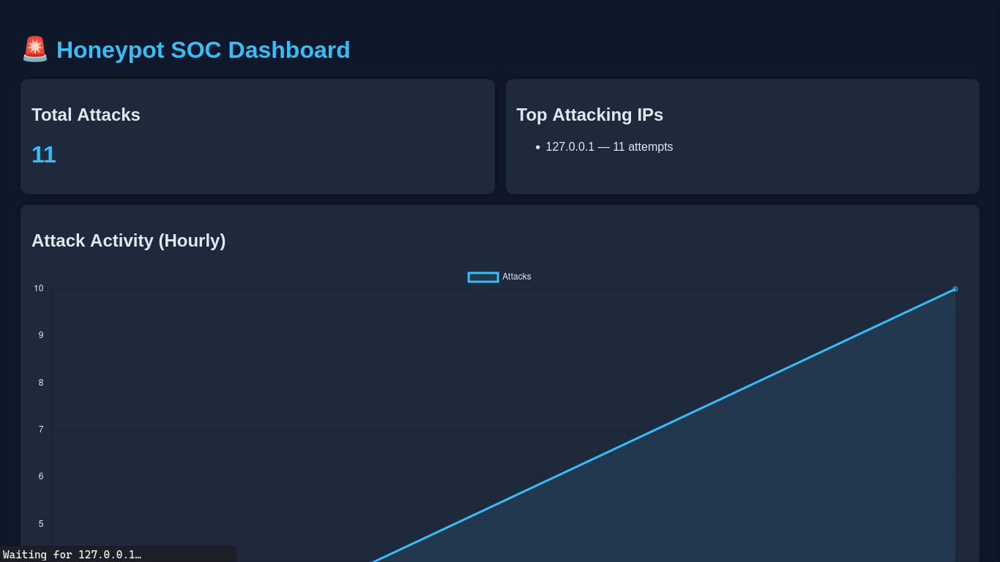
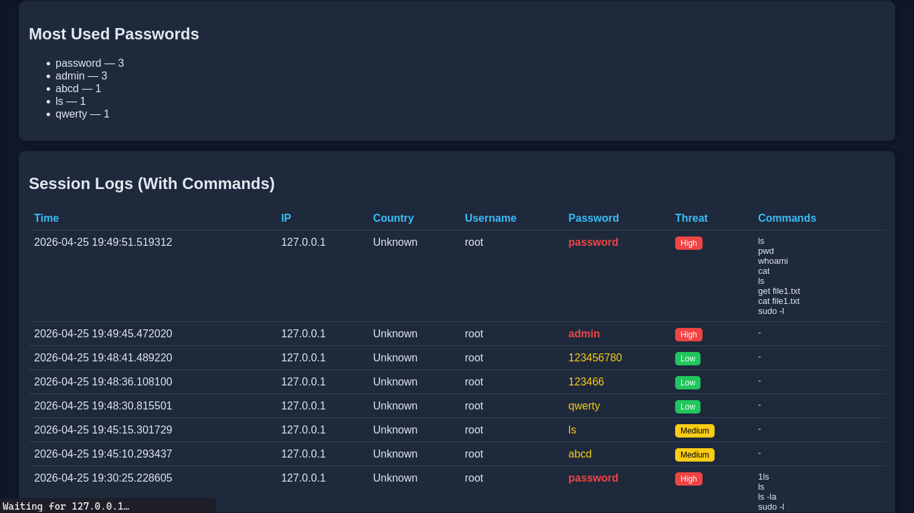
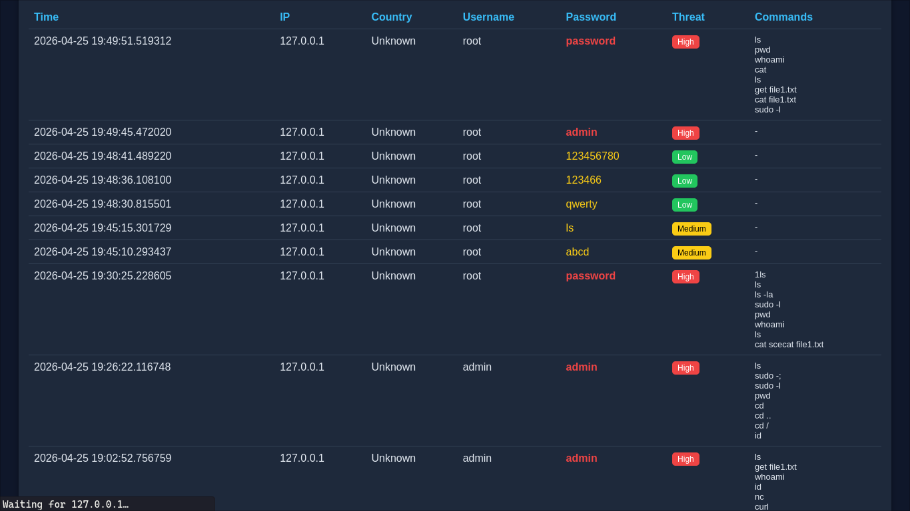

# 🚨 SSH Honeypot with Real-Time SOC Dashboard

A Python-based SSH honeypot that simulates a vulnerable server to capture real-world attack attempts, analyze attacker behavior, and visualize insights through a live web dashboard.

---

## 📌 Overview

This project mimics a real SSH service and logs unauthorized access attempts in real time.  
It captures attacker IPs, credentials, and post-login activity, providing insights similar to a **mini SOC (Security Operations Center)**.

---

## 📊 Dashboard Preview

<p align="center">
  
</p>

---

## 🧾 Logs & Command Activity

<p align="center">
  
  <br><br>
  
</p>

---

## 🔥 Features

- 🛡️ SSH Honeypot (Paramiko-based fake SSH server)
- 📊 Real-time monitoring dashboard (Flask)
- 🌍 GeoIP tracking (attacker country detection)
- 🚨 Brute-force & rapid attack detection
- 📈 Attack trend visualization (Chart.js)
- 🔍 Top attacking IPs & most used passwords
- ⚠️ Threat classification (Low / Medium / High)
- 💻 Command logging after successful login
- 🔄 Auto-refreshing dashboard (live monitoring)

---

## 🧱 Project Structure

```
honeypot/
├── honeypot.py # SSH honeypot server
├── detector.py # Attack detection logic
├── dashboard.py # Flask dashboard
├── geoip.py # IP geolocation lookup
├── logs.json # Captured logs
└── templates/
└── index.html # Dashboard UI
```

---

## ⚙️ Installation

### 1. Clone the repository

```
git clone https://github.com/0xs0l0/ssh-honeypot-dashboard.git
cd ssh-honeypot-dashboard
```

### 2. Install dependencies

```
pip install flask paramiko requests
```

---

## ▶️ Usage

### Start the honeypot

```
python honeypot.py
```

### Run the dashboard

```
python dashboard.py
```

### Access dashboard

```
http://127.0.0.1:5000
```

---

## 🧪 Testing

You can simulate attacks locally:

```
ssh admin@localhost -p 2222
```

Try weak credentials:

```
admin / password
root / 123456
```
All attempts will be logged and visualized in the dashboard.
---

## 📊 What You Can Observe

* Total attack count
* Top attacking IPs
* Most used passwords
* Attack activity over time
* Real-time login attempt logs

---

## ⚠️ Security Note

* Do **NOT** deploy on your main system
* Use a VPS or isolated environment
* Run on a non-standard port (e.g., 2222)
* This project is for **educational and research purposes only**

---

## 🧠 Skills Demonstrated

* Network security & attack simulation
* Log analysis & threat detection
* Python scripting & backend development
* Web dashboard development (Flask)
* Data visualization & monitoring
* Understanding of brute-force attacks and attacker behavior

---

## 🚀 Future Improvements

* 🌍 World map visualization of attackers
* 📩 Alert system (Email / Telegram)
* 🧠 Machine learning-based threat detection
* 📄 PDF report generation
* 🔐 Support for multiple honeypot services (FTP, HTTP)

---

## 📄 License

This project is intended for educational purposes only.

---

## 👨‍💻 Author

**Dhanesh C**

* Portfolio: https://0xsolo.vercel.app
* GitHub: https://github.com/0xs0l0
* LinkedIn: https://linkedin.com/in/cdhanesh

---

⭐ If you found this project useful, consider giving it a star!
